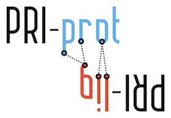

# Protein Recognition Index (PRI)

The Protein Recognition Index (PRI) measures the similarity between H-bonding features in a given complex (predicted or designed) and the characteristic H-bond trends from crystallographic complexes based on hydrogen-bond interactions idendified by [Hbind](https://github.com/psa-lab/Hbind) (software for rigorously defining intermolecular H-bonds by donor/acceptor chemistry and geometric constraints).

The PRI was developed, used, and described in detail in 

- Sebastian Raschka, Wolf A., Bemister-Buffington J., and Kuhn L.A. (2018) 
"Protein-ligand interfaces are polarized: Discovery of a strong trend for intermolecular hydrogen bonds to favor donors on the protein side with implications for predicting and designing ligand complexes." J. Computer-Aided Molec. Design [in revision]

Documentation: [insert link]

 
 
 

---

## Installation

## Usage

python code/pri-score.py
