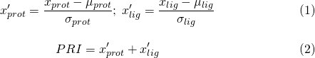

## User Guide

The Protein Recognition Score software can be executed from the command line and takes an [Hbind](http://psa-lab.github.io/Hbind) interaction table as input, which lists the hydrogen-bond interactions between a protein and its ligand.

The following example illustrates how to compute the PRI score for the 1KPF [1KPF](https://www.rcsb.org/pdb/explore.do?structureId=1kpf) complex (PKCI-substrate analog) with its ligand `1KPF_AMP.mol2` (adenosine monophsophate). The structures are provided in the "[example_files/](./example_files)" subdirectory along with the generated Hbind interaction table.

---


[Interactions between an PKCI-substrate analog ([1KPF](https://www.rcsb.org/pdb/explore.do?structureId=1kpf))  with its ligand (adenosine monophsophate) via [HbindViz](https://github.com/rasbt/HbindViz) and [PyMOL](https://pymol.org); hydrogen atoms not shown]

---

To compute the PRI score, simply invoke the following command in your terminal:

    python code/pri-score.py example_files/hbind_output.txt

The resulting output is shown below:

```
Protein Recognition Index, version 1.0.0

Documentation: http://psa-lab.github.io/protein-recognition-index
Raschka, Wolf, Bemister-Buffington, Kuhn (2018)
Protein Structure and Analysis Lab, MSU (http://kuhnlab.bmb.msu.edu)
    
Protein PRI: 252
Ligand PRI: 1584
PRI: 0.039
```

The Protein PRI (PRI-prot) and Ligand PRI (PRI-lig) scores are computed based on the hydrogen bond statistics across 136 non-homologous protein-ligand complexes as described in

- Sebastian Raschka, Wolf A., Bemister-Buffington J., and Kuhn L.A. (2018) 
"Protein-ligand interfaces are polarized: Discovery of a strong trend for intermolecular hydrogen bonds to favor donors on the protein side with implications for predicting and designing ligand complexes." J. Computer-Aided Molec. Design [in revision]

The PRI is then computed by standardizing the Protein and Ligand PRI scores and adding these, respectively:



Here, &mu; (mean) and &sigma; (standard deviation) were derived from the 136 PRI-lig and PRI-prot scores computed from the 136 non-homologous complexes. Hence, the range of the PRI score is [-2, 2], where higher scores are better.
